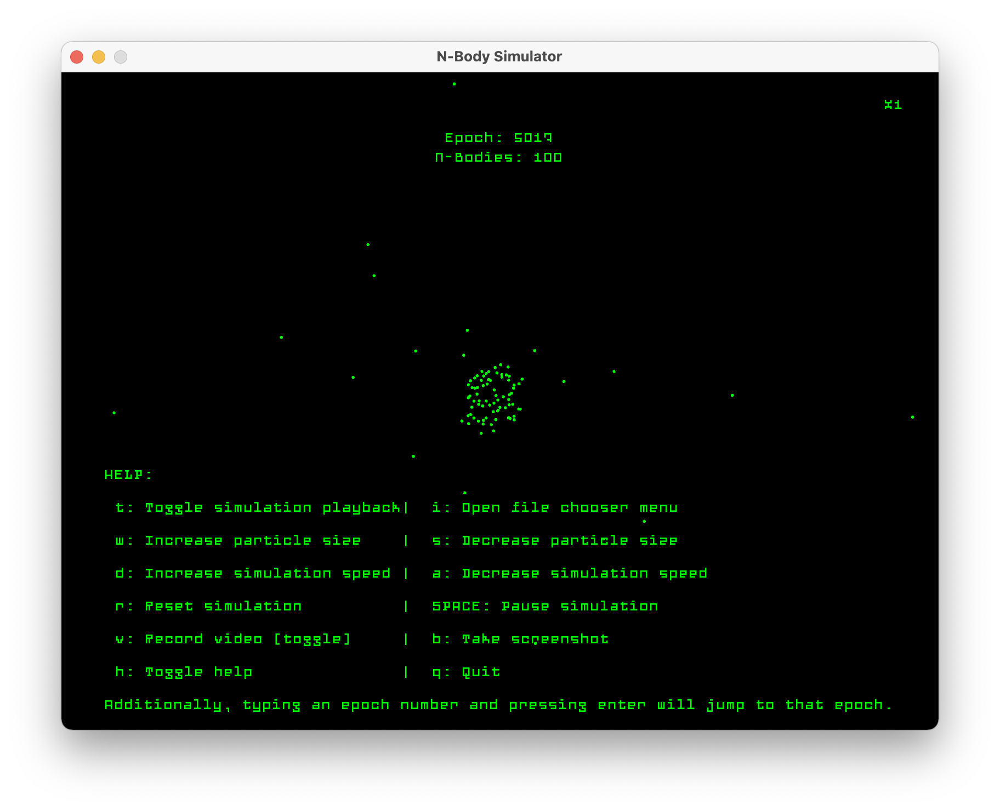

 ---  ---


## About
N-body computations involve simulating dynamic systems of particles under the influence of some physical force. Such forces can be gravity, electrostatics, or magnetism. N-body simulations can also be used for natural formations such as boids. This sort of computation requires a good deal of computational resources. For example, such simulations require billions of particles to accurately represent the interactions between galaxies.

This project aims to explore the benefits of parallelization, comparing performance between both the GPU and CPU implementation using the same brute-force algorithm. In addition, we will also be exploring GPU memory optimizations techniques and their performance effects on the runtime of the simulation.

The simulation is managed through the CLI where parameters such as the number of bodies, size of bodies, time, time-step, and either the CPU/GPU implementation may be selected. It then produces a file for the GUI to visualize. With both the GUI and the command-line interface implemented, the program may be run in a variety of environments, including remotely on more powerful servers rather than on a local machine.

## Setting Up

Here are the steps for getting the repository up and running on your local machine. You'll need conda.

>**Note:** you must have CUDA and Nvidia device installed on your machine in order to install cupy library. Here are the steps for that:
https://docs.cupy.dev/en/stable/install.html

```bash
git clone https://github.com/chrishollandaise/parallel-n-body-simulation.git
cd parallel-n-body-simulation
conda create -n nbody-sim python=3.8.8
conda activate nbody-sim
conda install -c conda-forge ffmpeg
pip install -r requirements.txt
pip install cupy-cuda114
```
If the Kivy application encounters errors, please run this command while in the same environment. For more information
check out the kivy docs: https://kivy.org/doc/stable/gettingstarted/installation.html
```bash
python -m pip install kivy[base]
```

## Showcase


## Additional Information
We have provided this repo with some particle configurations that can both demonstrate the simulation and visualization of our application.