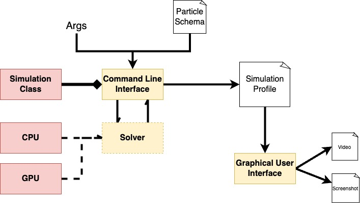

## About the scripts folder

### Architecture

### Simulation scripts
> **Note** Some of these scripts require to be ran at the local directory level.
1. `simulation.py` 
    - A class defintion that manage simulation state.
2. `simulate.py`
    - CLI that drives code for simulation
3. `nbody_cpu.py`
     - Sequential CPU n-body simulator
4. `nbody_gpu.py`
    - GPU n-body simulator

### GUI scripts
> **Note** These scripts should be ran at the root level.
1. `gui.py`
    - GUI driver.
2. `gui.kv`
    - A style file and intermediary file that contains information about the GUI layout

### Particle configuration scripts
1. `generate_rconfiguration.py`
    - A script that can generate random configuration of particles.